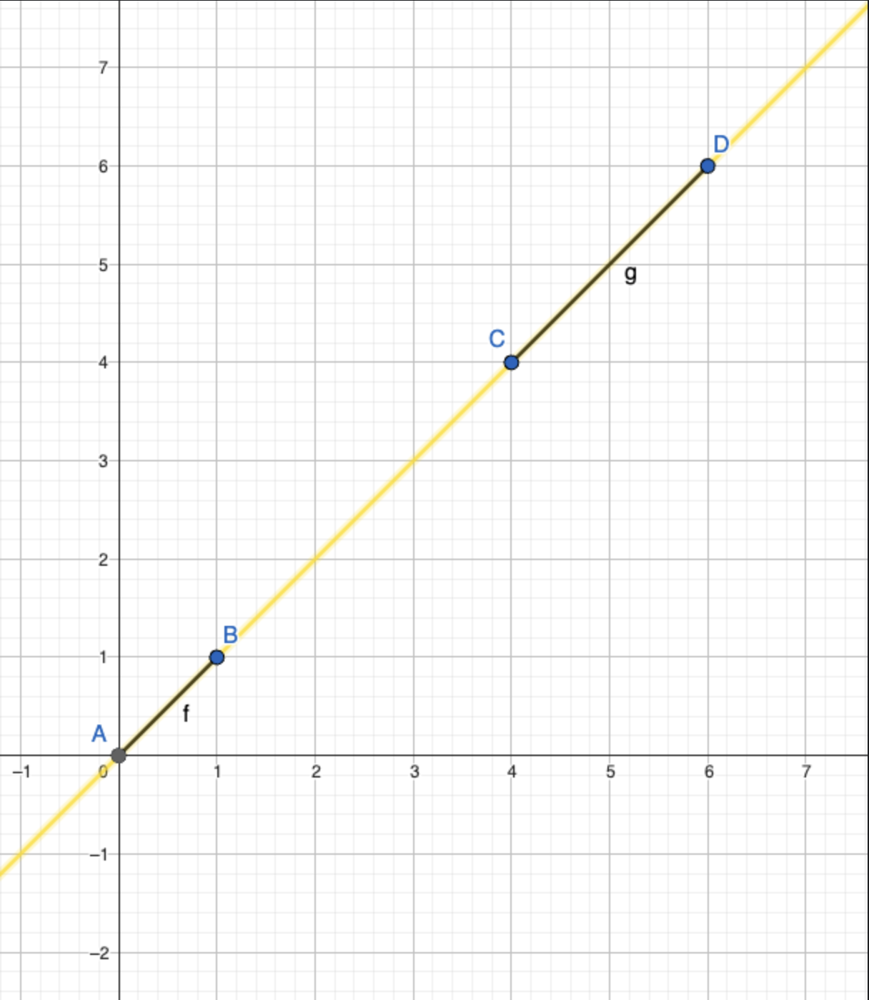

## Auswertung der Ergebnisse:

#### *Ziel der Aufgabe:*
- Ermitteln Sie die Anzahl der sich schneidenden Stecken
- Messen Sie die pro Datei aufgewendete Zeit

#### *Ansatz:*
Um die sich schneidenden Strecken, bzw. sich berührenden Strecken zu finden haben wir zwei Ansätze verfolgt.
Im ersten Ansatz, welcher die Methode *areIntercepting* ist, haben wir einen manuellen Ansatz verfolgt.
In der zweiten Methode *areIntercepting2*, haben wir einen Ansatz mit dem CCW verfolgt. Die genaue Beschreibung der
Methode wird im Folgenden genauer erklärt.

#### *1) Manueller Ansatz*
**Beschreibung:** In dieser ...

**Ergebnisse:**
- Im ersten Datensatz beträgt die Anzahl der sich kreuzenden Strecken 6, mit einem Zeitaufwand von 6.096666 ms
- Im zweiten Datensatz beträgt die Anzahl der sich kreuzenden Strecken 254, mit einem Zeitaufwand von 596.307333 ms
- Im dritten Datensatz beträgt die Anzahl der sich kreuzenden Strecken 25813, mit einem Zeitaufwand von 59.278553042 s

#### *2) Ansatz mit CCW*
**Beschreibung:** In dieser Methode gehen wir davon aus das der Graph 1 die Startpunkte P 
und Q hat, und der zweite Graph die Punkte R und S. Um den Schnittpunkten zu finden, wird zunächst der CCW
für PQR, PQS, RSP und RSQ berechnet. Anschließend werden die CCW-Werte verglichen, um 

**Ergebnisse:**
- Im ersten Datensatz beträgt die Anzahl der sich kreuzenden Strecken 11, mit einem Zeitaufwand von 2.164875 ms
- Im zweiten Datensatz beträgt die Anzahl der sich kreuzenden Strecken 374, mit einem Zeitaufwand von 211.145791 ms
- Im dritten Datensatz beträgt die Anzahl der sich kreuzenden Strecken 38616, mit einem Zeitaufwand von 20.897704 s

### Fazit
**1: Laufzeit**

Wenn die Laufzeiten beider Methoden verglichen werden, erkennt man dass die zweite Methode für alle drei Datensätze schneller ist.

**2: Anzahl der schneidenden Strecken**

Wenn wir die Anzahl der Schnittpunkte von beiden Methoden vergleichen (übersichtshalber 
nur im ersten Datensatz), sieht man das im ersten Ansatz 6 Schnittpunkte hat, und im 
zweiten Ansatz 11 Schnittpunkte. Der Unterschied von den Schnittpunkten, liegt daran, dass der Ansatz mit ccw 
Graphen mitzählt, welche auf einer Gerade liegen, aber sich nicht schneiden (siehe Abbildung)

